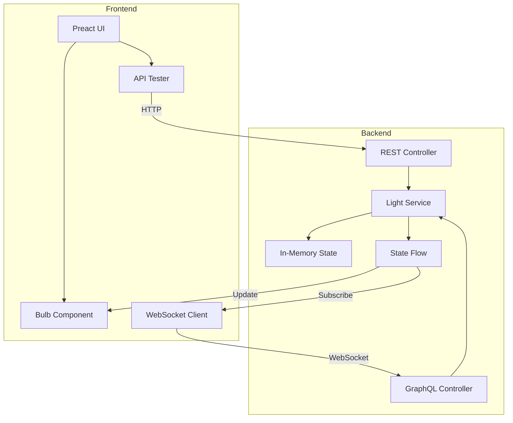

# Design Document

## Overview

The Shelly Lightbulb REST API Simulator is a full-stack web application that emulates the Shelly RGBW2 smart bulb API. The system consists of a Spring Boot backend written in Kotlin that provides REST and GraphQL APIs, and a Preact frontend that displays a real-time visual representation of the virtual bulb's state. The architecture emphasizes real-time synchronization using GraphQL subscriptions over WebSockets, ensuring that all connected clients see state changes immediately regardless of which API endpoint triggered the change.

### Technology Stack

**Backend:**
- Spring Boot 3.x
- Kotlin
- Spring Web (REST endpoints)
- Spring GraphQL (queries, mutations, subscriptions)
- Spring WebSocket (real-time communication)
- Kotlin Coroutines (async state management)

**Frontend:**
- Preact (lightweight React alternative)
- Vite (build tool)
- graphql-ws (WebSocket client)
- Native fetch API (REST calls)

## Architecture

### High-Level Architecture



### Request Flow

**REST API Flow:**
1. Client sends HTTP request to REST endpoint
2. Controller receives request and extracts parameters
3. Controller calls LightService method
4. Service updates in-memory state
5. Service emits state change to SharedFlow
6. Service returns updated state to controller
7. Controller serializes and returns response
8. All WebSocket subscribers receive state update

**GraphQL Flow:**
1. Client sends GraphQL query/mutation
2. GraphQL resolver receives request
3. Resolver calls LightService method
4. Service updates state and emits to SharedFlow
5. Resolver returns result
6. All WebSocket subscribers receive state update

**Subscription Flow:**
1. Client establishes WebSocket connection
2. Client sends subscription request
3. Backend registers subscriber to SharedFlow
4. When state changes, Flow emits new state
5. All subscribers receive update via WebSocket
6. Frontend updates visual representation

## Components and Interfaces

### Backend Components

#### 1. Data Models

**LightState.kt**
```kotlin
data class LightState(
    var ison: Boolean = false,
    var mode: LightMode = LightMode.COLOR,
    
    // Color mode properties
    var red: Int = 0,        // 0-255
    var green: Int = 0,      // 0-255
    var blue: Int = 0,       // 0-255
    var white: Int = 0,      // 0-255
    var gain: Int = 100,     // 0-100
    
    // White mode properties
    var brightness: Int = 100,  // 0-100
    var temp: Int = 4000,       // 3000-6500K
    
    // Common properties
    var transition: Int = 500,  // 0-5000ms
    var effect: Int = 0,        // 0-6
    var source: String = "http"
)

enum class LightMode {
    COLOR, WHITE
}
```

**DeviceStatus.kt**
```kotlin
data class DeviceStatus(
    val deviceId: String = "shellysimulator-001",
    val deviceType: String = "SHRGBW2",
    val firmware: String = "1.0.0-simulator",
    val light: LightState,
    val uptime: Long,
    val hasUpdate: Boolean = false
)
```

**RpcRequest.kt & RpcResponse.kt**
```kotlin
data class RpcRequest(
    val id: Int?,
    val method: String,
    val params: Map<String, Any>?
)

data class RpcResponse(
    val id: Int?,
    val result: Any?,
    val error: RpcError? = null
)

data class RpcError(
    val code: Int,
    val message: String
)
```

#### 2. Service Layer

**LightService.kt**

The service layer is the core of the application, managing state and coordinating updates.

**Responsibilities:**
- Maintain in-memory light state
- Validate and coerce parameter values
- Update state based on REST or RPC parameters
- Emit state changes to SharedFlow for subscriptions
- Provide state query methods

**Key Methods:**
- `getState()`: Returns current state
- `getDeviceStatus()`: Returns device status with metadata
- `updateState(params: Map<String, String>)`: Updates state from REST parameters
- `updateStateFromRpc(params: Map<String, Any>)`: Updates state from RPC parameters
- `toggle()`: Toggles on/off state
- `getConfig()`: Returns device configuration
- `getStateFlow()`: Returns SharedFlow for subscriptions

**State Management Strategy:**
- Single mutable LightState instance in memory
- SharedFlow with replay=1 for broadcasting changes
- Coroutines for async emission
- Parameter coercion using `coerceIn()` for range validation

#### 3. REST Controller

**ShellyRestController.kt**

**Endpoints:**
- `GET /light/{id}`: Get light state
- `POST /light/{id}`: Update light state
- `GET /color/{id}`: Get light state (color mode)
- `POST /color/{id}`: Update light state in color mode
- `GET /white/{id}`: Get light state (white mode)
- `POST /white/{id}`: Update light state in white mode
- `GET /status`: Get device status
- `GET /settings`: Get device settings
- `POST /rpc`: Handle RPC requests

**Design Decisions:**
- Use `@RequestParam` for query parameters (matches Shelly API style)
- Path variable `{id}` is accepted but ignored (single bulb simulation)
- CORS enabled for all origins
- All endpoints return JSON
- RPC endpoint uses `@RequestBody` for JSON payload

#### 4. GraphQL Schema & Resolvers

**schema.graphqls**
```graphql
type Query {
    lightState: LightState!
    deviceStatus: DeviceStatus!
}

type Mutation {
    setLight(input: LightInput!): LightState!
    toggleLight: LightState!
    setEffect(effect: Int!): LightState!
}

type Subscription {
    lightStateChanged: LightState!
}

type LightState {
    ison: Boolean!
    mode: String!
    red: Int!
    green: Int!
    blue: Int!
    white: Int!
    gain: Int!
    brightness: Int!
    temp: Int!
    transition: Int!
    effect: Int!
    source: String!
}

type DeviceStatus {
    deviceId: String!
    deviceType: String!
    firmware: String!
    light: LightState!
    uptime: Int!
}

input LightInput {
    turn: String
    mode: String
    red: Int
    green: Int
    blue: Int
    white: Int
    gain: Int
    brightness: Int
    temp: Int
    transition: Int
    effect: Int
}
```

**GraphQL Controller Design:**
- Query resolvers call service read methods
- Mutation resolvers call service update methods
- Subscription resolver returns Flow from service
- Spring GraphQL handles WebSocket transport automatically

### Frontend Components

#### 1. Component Structure

```
App
├── Bulb (visual representation)
├── StatusDisplay (current state info)
├── Controls (manual control UI)
└── ApiTester (API testing interface)
```

#### 2. Bulb Component

**Responsibilities:**
- Display full-screen background color matching bulb state
- Display realistic 3D bulb representation resembling Shelly smart bulb
- Animate color transitions
- Convert white mode temperature to RGB
- Render bulb with proper proportions and visual elements

**Visual Design:**
- Bulb shape: SVG or CSS-based 3D bulb with glass envelope and base
- Glass envelope: Semi-transparent with gradient for depth
- Bulb base: E27 screw base with metallic appearance
- Filament/LED area: Inner glow that changes color based on state
- Shadows and highlights: Multiple layers for 3D effect
- Glow effect: Radial gradient extending beyond bulb when on
- Proportions: Realistic A60 bulb dimensions (60mm diameter, ~110mm height)

**State Management:**
- Receives state via props from parent
- Uses useEffect to update colors when state changes
- Maintains local bgColor and transition state for rendering
- Manages glow intensity based on ison state

**Color Calculation:**
- Color mode: Apply gain multiplier to RGB values
- White mode: Convert Kelvin to RGB, apply brightness multiplier
- Off state: Dimmed bulb with minimal glow (#000000 background)
- On state: Full color with appropriate glow intensity

**Kelvin to RGB Conversion:**
Uses standard color temperature algorithm:
- Temp ≤ 66: Red=255, calculate Green
- Temp > 66: Calculate Red and Green
- Blue based on temperature range
- All values clamped to 0-255

**Visual States:**
- Off: Dark glass, no glow, visible base structure
- On (Color mode): Colored glow from center, glass tinted with color
- On (White mode): White/warm glow based on temperature
- Transition: Smooth color interpolation with glow fade

#### 3. Color Preset Component

**Responsibilities:**
- Display color preset buttons for quick testing
- Send API requests when presets are clicked
- Provide visual feedback on interaction
- Support both color and white mode presets

**Preset Configuration:**
```javascript
const colorPresets = [
  { name: 'Red', rgb: [255, 0, 0], mode: 'color' },
  { name: 'Green', rgb: [0, 255, 0], mode: 'color' },
  { name: 'Blue', rgb: [0, 0, 255], mode: 'color' },
  { name: 'Yellow', rgb: [255, 255, 0], mode: 'color' },
  { name: 'Purple', rgb: [128, 0, 128], mode: 'color' },
  { name: 'Cyan', rgb: [0, 255, 255], mode: 'color' },
  { name: 'Warm White', temp: 3000, mode: 'white' },
  { name: 'Cool White', temp: 6500, mode: 'white' }
]
```

**UI Design:**
- Horizontal or grid layout of color buttons
- Each button displays the color it represents (background color)
- Button size: 50-60px square or circular
- Hover effect: Scale up slightly, add border
- Active/clicked effect: Brief animation or border highlight
- Positioned below or beside the bulb (non-obstructive)
- Responsive layout for different screen sizes

**API Integration:**
- Color presets: POST to /color/0 with red, green, blue, turn=on
- White presets: POST to /white/0 with temp, brightness=100, turn=on
- Use fetch API for requests
- Handle errors gracefully
- No loading state needed (instant feedback via subscription)

#### 4. API Tester Component

**Responsibilities:**
- Provide UI for selecting endpoint and method
- Allow parameter input
- Execute API requests
- Display formatted responses

**Features:**
- Dropdown for endpoint selection
- Dropdown for HTTP method
- Text input for query parameters
- Send button to execute request
- Response display area with JSON formatting

#### 5. GraphQL WebSocket Client

**graphql.js Service:**
- Uses `graphql-ws` library
- Establishes WebSocket connection to backend
- Provides `subscribeLightState(callback)` function
- Handles connection errors and reconnection

**Integration:**
- App component subscribes on mount
- Callback updates local state
- State passed to Bulb component via props
- Automatic re-render on state change

#### 6. App Component

**Responsibilities:**
- Manage global light state
- Establish GraphQL subscription
- Render child components
- Pass state to children
- Layout management for new components

**Component Layout:**
```
App
├── Background (full-screen color)
├── Bulb (centered, realistic 3D design)
├── ColorPresets (positioned below or beside bulb)
└── ApiTester (collapsible panel or side drawer)
```

**Lifecycle:**
- On mount: Subscribe to lightStateChanged
- On state update: Update local state, trigger re-render
- On unmount: Unsubscribe from WebSocket

**Layout Strategy:**
- Use CSS Grid or Flexbox for responsive layout
- Bulb centered vertically and horizontally
- Color presets positioned for easy access without obstruction
- API tester can be toggled or positioned in corner
- Maintain visual hierarchy: Bulb is primary focus

## Data Models

### State Representation

The light state is represented consistently across all API formats:

**Internal Model (Kotlin):**
```kotlin
LightState(
    ison = true,
    mode = COLOR,
    red = 255,
    green = 128,
    blue = 0,
    white = 0,
    gain = 100,
    brightness = 100,
    temp = 4000,
    transition = 500,
    effect = 0,
    source = "http"
)
```

**REST Response (JSON):**
```json
{
  "ison": true,
  "mode": "color",
  "red": 255,
  "green": 128,
  "blue": 0,
  "white": 0,
  "gain": 100,
  "brightness": 100,
  "temp": 4000,
  "transition": 500,
  "effect": 0,
  "source": "http"
}
```

**GraphQL Response:**
```json
{
  "data": {
    "lightState": {
      "ison": true,
      "mode": "COLOR",
      "red": 255,
      "green": 128,
      "blue": 0,
      "white": 0,
      "gain": 100,
      "brightness": 100,
      "temp": 4000,
      "transition": 500,
      "effect": 0,
      "source": "http"
    }
  }
}
```

### Parameter Mapping

**REST to Internal:**
- Query parameters parsed as strings
- Converted to appropriate types
- Validated and coerced to valid ranges

**RPC to Internal:**
- JSON body parsed to Map<String, Any>
- Special handling for `rgb` array parameter
- Boolean `on` maps to `ison`
- Numeric values extracted and coerced

**GraphQL to Internal:**
- Input type automatically mapped by Spring GraphQL
- Null values ignored (optional fields)
- Validation handled by schema

## Error Handling

### REST API Errors

**Strategy:**
- Invalid parameters: Ignore and use current value
- Out-of-range values: Coerce to valid range
- Unknown endpoints: Spring Boot default 404
- Malformed requests: Spring Boot default 400

**Rationale:**
Shelly devices are lenient with parameters, so the simulator matches this behavior for authenticity.

### RPC API Errors

**Error Codes:**
- `-32601`: Method not found
- `-32602`: Invalid params (if implemented)
- `-32603`: Internal error (if implemented)

**Response Format:**
```json
{
  "id": 1,
  "result": null,
  "error": {
    "code": -32601,
    "message": "Method not found: InvalidMethod"
  }
}
```

### GraphQL Errors

**Strategy:**
- Schema validation: Automatic by Spring GraphQL
- Resolver errors: Return GraphQL error response
- Subscription errors: Log and close connection

**Error Format:**
```json
{
  "errors": [
    {
      "message": "Invalid parameter value",
      "path": ["setLight"],
      "extensions": {
        "classification": "ValidationError"
      }
    }
  ]
}
```

### Frontend Error Handling

**API Tester:**
- Catch fetch errors
- Display error message in response area
- Show network errors clearly

**WebSocket:**
- Log connection errors to console
- Attempt automatic reconnection
- Display connection status (optional enhancement)

## Testing Strategy

### Backend Testing

**Unit Tests:**
- LightService state management
- Parameter validation and coercion
- Mode switching logic
- Toggle functionality

**Integration Tests:**
- REST endpoint responses
- RPC request handling
- GraphQL query/mutation execution
- WebSocket subscription delivery

**Test Data:**
- Valid parameter ranges
- Boundary values (0, 255, 100, etc.)
- Invalid values (negative, too large)
- Missing parameters
- Unknown parameters

### Frontend Testing

**Component Tests:**
- Bulb color calculation
- Kelvin to RGB conversion
- Transition animation
- API tester request building

**Integration Tests:**
- WebSocket connection
- State synchronization
- API request/response handling

**Manual Testing:**
- Visual verification of colors
- Transition smoothness
- Real-time update latency
- Multiple client synchronization

### End-to-End Testing

**Scenarios:**
1. Turn on light via REST, verify frontend updates
2. Change color via GraphQL, verify frontend updates
3. Toggle via RPC, verify frontend updates
4. Multiple clients connected, verify all update
5. Rapid state changes, verify no race conditions
6. WebSocket reconnection after disconnect

## Configuration

### Backend Configuration

**application.yml:**
```yaml
server:
  port: 8080

spring:
  graphql:
    websocket:
      path: /graphql/ws
    path: /graphql
  web:
    cors:
      allowed-origins: "*"
      allowed-methods: "*"
      allowed-headers: "*"
```

**build.gradle.kts:**
```kotlin
plugins {
    kotlin("jvm") version "1.9.0"
    kotlin("plugin.spring") version "1.9.0"
    id("org.springframework.boot") version "3.2.0"
}

dependencies {
    implementation("org.springframework.boot:spring-boot-starter-web")
    implementation("org.springframework.boot:spring-boot-starter-graphql")
    implementation("org.springframework.boot:spring-boot-starter-websocket")
    implementation("org.jetbrains.kotlin:kotlin-reflect")
    implementation("com.fasterxml.jackson.module:jackson-module-kotlin")
    implementation("org.jetbrains.kotlinx:kotlinx-coroutines-core")
    implementation("org.jetbrains.kotlinx:kotlinx-coroutines-reactor")
}
```

### Frontend Configuration

**vite.config.js:**
```javascript
import { defineConfig } from 'vite'
import preact from '@preact/preset-vite'

export default defineConfig({
  plugins: [preact()],
  server: {
    port: 3000,
    proxy: {
      '/light': 'http://localhost:8080',
      '/color': 'http://localhost:8080',
      '/white': 'http://localhost:8080',
      '/status': 'http://localhost:8080',
      '/rpc': 'http://localhost:8080',
      '/graphql': {
        target: 'http://localhost:8080',
        ws: true
      }
    }
  }
})
```

**package.json:**
```json
{
  "name": "shelly-simulator-frontend",
  "version": "1.0.0",
  "scripts": {
    "dev": "vite",
    "build": "vite build",
    "preview": "vite preview"
  },
  "dependencies": {
    "preact": "^10.19.0",
    "graphql-ws": "^5.14.0"
  },
  "devDependencies": {
    "vite": "^5.0.0",
    "@preact/preset-vite": "^2.7.0"
  }
}
```

## Design Decisions & Rationales

### 1. In-Memory State Only

**Decision:** Store state in memory without persistence.

**Rationale:**
- Simplifies implementation
- Sufficient for simulator/testing use case
- State reset on restart is acceptable
- Can be enhanced later if needed

### 2. Single Bulb Simulation

**Decision:** Simulate only one bulb, ignore ID parameter.

**Rationale:**
- Reduces complexity
- Covers most testing scenarios
- Path parameter maintained for API compatibility
- Multi-bulb support can be added later

### 3. SharedFlow for State Broadcasting

**Decision:** Use Kotlin SharedFlow with replay=1.

**Rationale:**
- Replay ensures new subscribers get current state
- Multiple subscribers supported automatically
- Integrates well with Spring GraphQL subscriptions
- Coroutine-based for efficient async handling

### 4. Preact Over React

**Decision:** Use Preact instead of React.

**Rationale:**
- Smaller bundle size (3KB vs 40KB)
- Same API as React
- Faster performance
- Sufficient for simple UI needs

### 5. Full-Screen Color Background

**Decision:** Change entire page background color.

**Rationale:**
- Maximum visual impact
- Immediately obvious state changes
- Simulates room lighting effect
- Simple to implement

### 6. Lenient Parameter Validation

**Decision:** Coerce invalid values instead of rejecting.

**Rationale:**
- Matches real Shelly device behavior
- More forgiving for testing
- Prevents API errors from stopping tests
- Values always stay in valid ranges

### 7. GraphQL Subscriptions Over SSE

**Decision:** Use GraphQL subscriptions via WebSocket.

**Rationale:**
- Bidirectional communication
- Standard GraphQL feature
- Better browser support
- Automatic reconnection handling

### 8. Separate REST and GraphQL APIs

**Decision:** Implement both API styles independently.

**Rationale:**
- Allows testing both integration approaches
- REST matches Shelly API exactly
- GraphQL provides modern alternative
- Both update same underlying state

## Performance Considerations

### Backend

**State Updates:**
- Single mutable state object (no copying overhead)
- SharedFlow emission is async (non-blocking)
- Coercion operations are O(1)

**Concurrency:**
- State mutations are not thread-safe
- Acceptable for single-user simulator
- Can add synchronization if needed

**Memory:**
- Single LightState instance (~100 bytes)
- SharedFlow buffer size = 1
- Minimal memory footprint

### Frontend

**Rendering:**
- State updates trigger single re-render
- CSS transitions handled by browser
- No complex calculations in render loop

**WebSocket:**
- Single persistent connection
- Minimal bandwidth (small JSON payloads)
- Updates only when state changes

**Color Calculations:**
- Kelvin to RGB: Simple arithmetic
- Performed once per state change
- Cached in component state

## Security Considerations

### Development Mode

**Current Design:**
- CORS allows all origins
- No authentication
- No rate limiting
- All endpoints publicly accessible

**Rationale:**
This is a development simulator, not a production service. Security is intentionally minimal for ease of use.

### Future Enhancements

If deployed publicly:
- Add API key authentication
- Restrict CORS origins
- Implement rate limiting
- Add request validation
- Use HTTPS/WSS

## Deployment

### Development

**Backend:**
```bash
./gradlew bootRun
```
Runs on http://localhost:8080

**Frontend:**
```bash
npm run dev
```
Runs on http://localhost:3000 with proxy to backend

### Production Build

**Backend:**
```bash
./gradlew build
java -jar build/libs/shelly-simulator.jar
```

**Frontend:**
```bash
npm run build
```
Outputs to `dist/` directory, can be served by any static host

### Docker (Optional Enhancement)

```dockerfile
# Backend
FROM eclipse-temurin:17-jdk-alpine
COPY build/libs/*.jar app.jar
ENTRYPOINT ["java","-jar","/app.jar"]

# Frontend
FROM nginx:alpine
COPY dist/ /usr/share/nginx/html
```

## Future Enhancements

### Phase 2 Features

1. **Effect Animations:**
   - Implement visual effects (meteor shower, gradual change, flash)
   - Use CSS animations or canvas rendering
   - Animate bulb appearance during effects

2. **Timer Support:**
   - Implement countdown timers
   - Auto-toggle after duration
   - Display remaining time

3. **State Persistence:**
   - Save state to database or file
   - Restore on restart

4. **Multiple Bulbs:**
   - Support multiple virtual bulbs
   - Use ID parameter to select bulb
   - Independent state for each
   - Multiple bulb visualizations on screen

5. **Advanced UI:**
   - Color picker for manual control
   - Custom preset creation and saving
   - Preset scenes with multiple colors
   - Effect preview
   - Connection status indicator
   - Brightness slider
   - Temperature slider for white mode

6. **Metrics:**
   - API call statistics
   - State change history
   - Performance monitoring

## Visual Design Details

### Bulb Component Structure

**SVG/CSS Implementation Options:**

**Option 1: CSS-based (Simpler, faster to implement)**
```css
.bulb-container {
  position: relative;
  width: 200px;
  height: 280px;
}

.bulb-glass {
  width: 120px;
  height: 160px;
  border-radius: 50% 50% 50% 50% / 60% 60% 40% 40%;
  background: radial-gradient(circle at 30% 30%, rgba(255,255,255,0.8), transparent);
  box-shadow: inset 0 0 30px rgba(0,0,0,0.2);
}

.bulb-glow {
  position: absolute;
  width: 80px;
  height: 80px;
  border-radius: 50%;
  filter: blur(20px);
  transition: all 0.5s;
}

.bulb-base {
  width: 60px;
  height: 40px;
  background: linear-gradient(to bottom, #888, #555);
  border-radius: 5px;
}
```

**Option 2: SVG-based (More detailed, scalable)**
- Use SVG path for precise bulb shape
- Multiple layers for glass, glow, base
- SVG filters for realistic effects
- Better for complex animations

**Recommended: CSS-based for MVP, SVG for future enhancement**

### Color Preset Button Design

**Button Styling:**
```css
.color-preset-btn {
  width: 50px;
  height: 50px;
  border-radius: 50%;
  border: 2px solid rgba(255,255,255,0.3);
  cursor: pointer;
  transition: transform 0.2s, box-shadow 0.2s;
}

.color-preset-btn:hover {
  transform: scale(1.1);
  box-shadow: 0 0 15px rgba(255,255,255,0.5);
}

.color-preset-btn:active {
  transform: scale(0.95);
}
```

**Layout:**
- Horizontal row below bulb
- 8-10px spacing between buttons
- Centered alignment
- Wrap on smaller screens
- Optional: Group by type (colors vs whites)

### Responsive Design

**Breakpoints:**
- Desktop (>1024px): Large bulb, horizontal preset row
- Tablet (768-1024px): Medium bulb, wrapped presets
- Mobile (<768px): Smaller bulb, grid layout for presets

**Accessibility:**
- Color preset buttons include aria-labels
- Keyboard navigation support
- Focus indicators
- Sufficient color contrast for text
